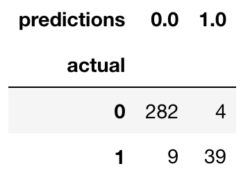

# Introduction

* **Key topics or concepts:** What are we trying to build, why, and what are the high level components of the solution
* **Estimated time:** 3 minutes read

Here is a 2 minutes video of this step:

<iframe src="https://broadcast.amazon.com/embed/139998" width="682" height="384" style="border:0" allowfullscreen></iframe>

In our example, you are a developer who has been asked to create a Machine Learning model that can classify whether a customer will churn or not. While you could create the model using EC2 instances, you worry that managing all of those connections and scaling them will be time consuming and complex as the training code becomes more sophisticated.

To solve this challenge, you decide to use [Amazon SageMaker](https://docs.aws.amazon.com/sagemaker/latest/dg/whatis.html). A fully managed service that enables data scientists and developers to quickly and easily build machine-learning based models into production smart applications.

In the next 30 minutes, you will create a Machine Learning model to classify customers on their churn propensity. You'll use Amazon Sagemaker and S3, both services are within the AWS Free Tier.

Here is the prediction model you will be creating:

Let’s take a look at what we do in this notebook:
1. We pull the source data and review it
2. We load it into S3 so it can be consumed by the xgboost algorithm
3. We train the xgboost algorithm using input data
4. We deploy the model
