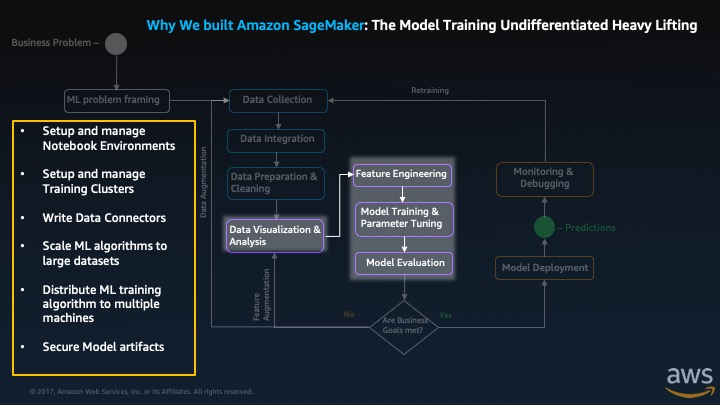

# Overview

* **COURSE OBJECTIVE:** This tutorial is designed to show you how by using SageMaker you can easily build a machine learning (ML) model, train, and deploy it to production.
* **ESTIMATED TIME:** 30 minutes
* **TARGET AUDIENCE:** Developers/ML enthusiasts with no hands-on experience in SageMaker. ML knowledge is not required.

Wondering about how to get started with SageMaker? How to build a ML model, train, and deploy it to production? You’re in luck! This tutorial is intended for folks who want to learn about SageMaker and haven’t used it before! Most of the steps in this tutorial have a short video at the beginning of the step. The video is a demonstration of the step with some additional insights so we recommend that you watch it before you follow the steps unless you are already familiar with SageMaker and just want to copy paste the commands from the tutorial and get up and running quickly.

Here is a 9 minutes video of what you are going to build:

<iframe src=" https://youtu.be/smsKhmF_N5Q" width="682" height="384" style="border:0" allowfullscreen></iframe>

**Presentation slides:**

In this tutorial you will create a classification model that will predict whether a given customer is likely to churn or not.
